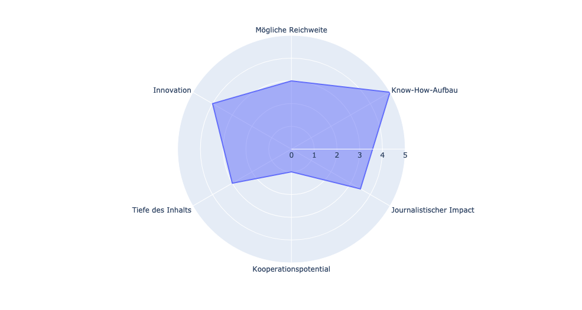
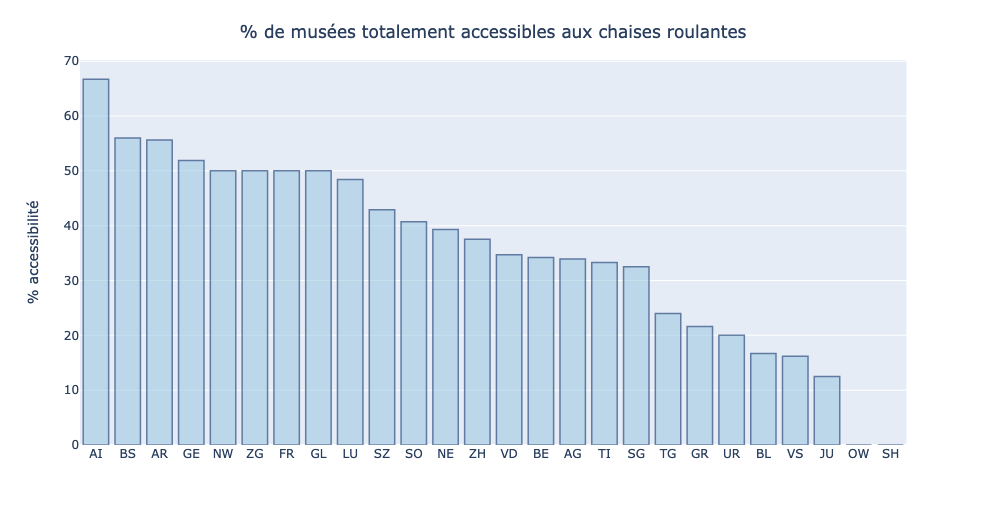
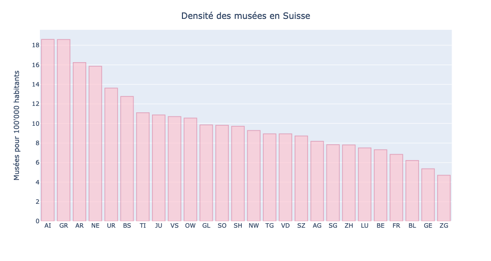
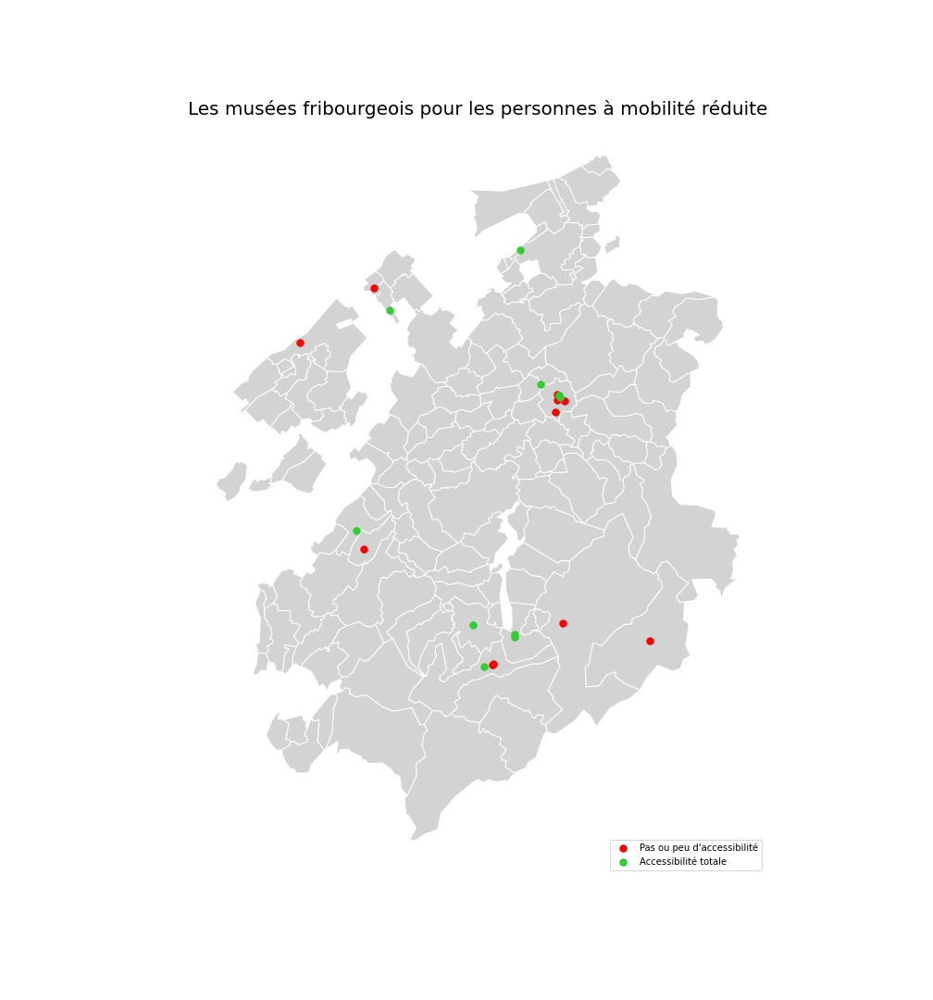

# Abschlussarbeit - CAS in Datenjournalismus - Nicolas Maradan

 

## Der publizierte Artikel

fdsafadsfasdf

## Ausgangsthese

Kultur muss für alle zugänglich sein. Aber ist es wirklich so? In der Schweiz sind viele Museen nicht oder nur teilweise für Personen mit eingeschränkter Mobilität geeignet. Das Ziel unserer Analyse ist es, genau herauszufinden, wie viel Prozent und warum.

## Idee

Für unsere Analyse verwenden wir die Suchmaschine, die auf der Website des Verband der Museen der Schweiz verfügbar ist. Mit diesem Tool können wir alle Museen in der Schweiz nach Kanton durchsuchen. Es ist möglich, nach verschiedenen Kriterien zu suchen, zum Beispiel nach der Rollstuhlgängigkeit. Wir werden die Informationen mit BeautifulSoup und Selenium sammeln. Ziel ist es herauszufinden, wie viel Prozent der Museen für Rollstuhlfahrer völlig zugänglich sind. Unser erster Eindruck ist, dass diese Rate sehr niedrig ist. Aber wieso? Offensichtlich befinden sich einige Museen in alten Gebäuden wie ein Schloss, in denen es nicht möglich ist, Zugangsrampen bereitzustellen. Aber könnten zusätzliche Anstrengungen unternommen werden? Dies ist eine der Fragen, die wir stellen müssen.

## Einschätzung von Aufwand / Ertrag

Auf den ersten Blick sollte das Sammeln der Daten kein Problem sein, da die Website des Verbandes der Museen der Schweiz gut strukturiert zu sein scheint. Wir sollten jedoch ein wenig Arbeit erwarten, um die Daten zu bereinigen. Es wird auch Zeit für die Datenarbeit mit Pandas brauchen, aber auch für die Arbeit mit Geodatena (mit dem Google API-Schlüssel und Geopandas). Wir sollten auch nicht vergessen, Zeit für die grafische Visualisierung aufzuwenden, um die Daten und insbesondere die Geodaten so klar wie möglich darstellen zu können. Es ist eine Herausforderung, weil ich noch nie zuvor Geodaten verwendet habe! Meine Idee ist es, einen Teil der Daten auf einer Karte mit präziser Geolokalisierung darstellen zu können. Angesichts der großen Anzahl von Museen in der Schweiz (mehr als 1200) erscheint es mir jedoch nicht relevant, sie alle auf einer Landkarte zu platzieren. Es würde zu viele Punkte auf der Karte geben und es wäre nicht lesbar. Bei dieser Grafik werde ich mich daher auf die Museen des Kantons Freiburg konzentrieren. Aber ich werde natürlich andere Grafiken erstellen, die die Daten für die gesamte Schweiz nach Kanton darstellen.

## Knackpunkte

1. Die Suchmaschine bietet zwei Kategorien: "Vollständige Rollstuhlgängigkeit" und "Teilweise Rollstuhlzugänglich". Kategorie "Vollständige Rollstuhlgängigkeit" funktioniert sehr gut. Es gibt jedoch ein Problem mit der Kategorie "Teilweise Rollstuhlzugänglich". In einigen Kantonen wie Appenzell Innerrhoden umfasst diese Kategorie nur die Museen, die teilweise Rollstuhlzugänglich sind. Aber in anderen Kantonen wie Basel-Landschaft umfasst diese Kategorie sowohl die Museen, die vollständig zugänglich sind, als auch solche, die nur teilweise zugänglich sind. Es verzerrt die Berechnungen. Und die Tatsache, dass Rollstühle nur teilweise zugänglich sind, kann von Museum zu Museum unterschiedlich sein. Deshalb habe ich mich entschieden, nur die Kategorie "Vollständige Rollstuhlgängigkeit" zu verwenden. Meiner Meinung nach ist dies gerechtfertigt, da es für eine Person, die sich im Rollstuhl bewegen muss, wichtig ist, vollen und nicht nur teilweisen Zugang zu haben.

2. Für die grafische Darstellung der Daten sind mehrere Lösungen möglich. Dank Modulen wie **Matplotlib** oder **Plotly** können wir direkt mit Python arbeiten. Wir können auch Schnittstellen wie **Datawrapper** oder **Flourish** verwenden. Also, welche Lösung sollen wir wählen? Um dies herauszufinden, ist es ideal, beide Lösungen testen zu können. Deshalb habe ich sowohl mit Plotly als auch mit Datawrapper Grafiken erstellt. Ich habe etwas länger gebraucht, aber es hat sich gelohnt. Beide Lösungen sind interessant. In beiden Fällen sind die Grafiken lesbar und effizient. Es war daher sehr schwer zu wählen. Am Ende habe ich mich für die mit **Datawrapper** erstellten grafischen Darstellungen entschieden, da diese interaktiver sind.

Hier sind die grafischen Visualisierungen, die direkt mit **Plotly** und **Geopandas** gemacht werden.

Und hier sind die grafischen Visualisierungen, die mit **Datawrapper** erstellt wurden.

## Briefingpersonen

Zuerst musst

## Programmiercode

Zuerst musst

## Arbeitsprotokoll

| Datum  | Aufwand | Tätigkeit |
| ------------- | ------------- | ------------- |
| 28.12.2020  | 2h  | Idee entwickeln, Ausgangsthese ausarbeiten  |
| 29.12.2020  | 8h  | Scraper für Museen schreiben (in meinem Notebook **Museen.ipynb**) |
| 30.12.2020  | 1h30  | Google API-Schlüssel erstellen |
| 30.12.2020  | 7h  | Mit den Geodaten arbeiten (in meinem Notebook **Museen.ipynb**) |
| 31.12.2020  | 1h  | Notebook **Museen.ipynb** kommentieren (es ist sehr wichtig, dass mein Code so klar wie möglich ist. Es muss nicht nur für andere verständlich sein, sondern auch für mich selbst, wenn ich es in einigen Monaten oder Jahren wieder verwenden muss) |
| 31.12.2020  | 0h30  | Repository auf Github erstellen |
| 31.12.2020  | 1h30  | Mein Github-Repository ausfüllen, mit Informationen wie die Ausgangsthese, die Einschätzung von Aufwand/Ertrag, die Bezeichnung des Knackpunkts des Projektes |
| 01.01.2021  | 4h  | Grafischer Darstellungen mit **Datawrapper** und **Plotly** testen |
| 02.01.2021  | 0h30  | Spider für Einschätzung von Aufwand / Ertrag erstellen |
